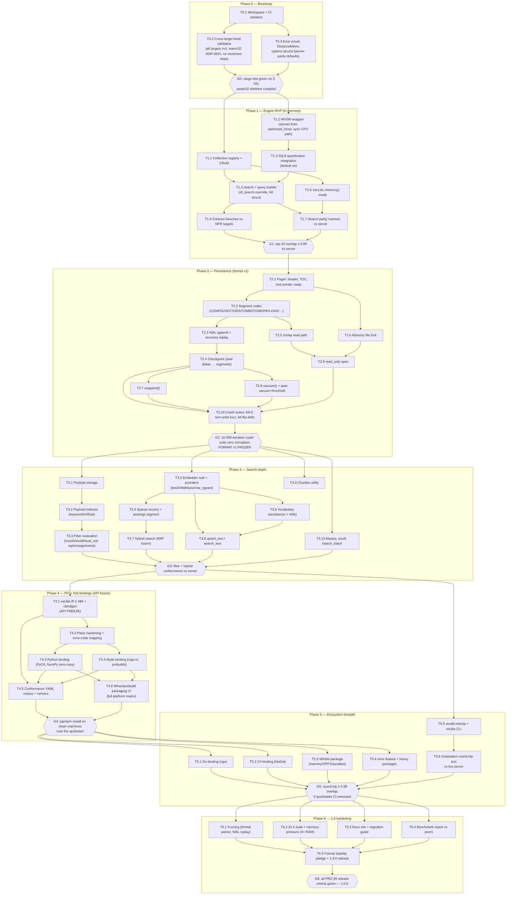

# VecLite — Implementation DAG

Dependency graph of all implementation work items from empty repo to the 1.0.0 release. Derived from the [roadmap](vectorizer-lite/08-roadmap.md) phases and the [PRD](PRD.md) requirements; each task links the spec(s) that govern it.

Conventions:

- **Task IDs** are `T<phase>.<n>` and are stable — commits, issues, and PRs should reference them.
- An edge `A → B` means **B cannot start until A is done** (hard dependency). Tasks with no edge between them may run in parallel.
- **Gates** (`G<phase>`) are the phase exit criteria — quality checkpoints that block everything downstream of them.
- Format v1 freezes at **G2**; the public Rust API freezes at **T4.1** (the FFI layer is the forcing function).

## 1. Graph



## 2. Critical path

The longest hard-dependency chain (everything else parallelizes around it):

```
T0.1 → T0.2 → G0 → T1.2 → T1.3 → T1.4 → T1.7 → G1
     → T2.1 → T2.2 → T2.3 → T2.4 → T2.10 → G2
     → T3.5 → T3.4 → T3.7 → G3
     → T4.1 → T4.2 → T4.3/T4.4 → T4.5 → G4
     → T5.5 → T5.6 → G5
     → T6.1/T6.2 → T6.5 → G6
```

Implications:

- **Storage (Phase 2) is the schedule anchor** — the crash suite (T2.10) gates every later phase, and the format freeze cannot be rushed (NFR-11 makes v1 permanent).
- **Bindings intentionally start late** (G3): every task in Phases 0–3 may change the public API freely; after T4.1 changes are additive-only.
- Parallelization opportunities: T1.1/T1.2 (two workstreams after G0); T2.5–T2.9 fan out after T2.2; T3.1-chain and T3.5-chain are independent until G3; all of Phase 5 fans out after G4 (T5.5 needs only G3 and can start even earlier).

## 3. Task table

| ID | Task | Depends on | Spec(s) | PRD reqs | Deliverable / exit test |
|---|---|---|---|---|---|
| **T0.1** | Cargo workspace (`crates/veclite`), CI: fmt + clippy `-D warnings` + test on Linux/macOS/Windows; MSRV decision (OQ-2) | — | SPEC-016 | NFR-09 | Green pipeline on empty-ish crate |
| **T0.2** | Cross-target build validation on 3 OS + `wasm32-unknown-unknown`. ADR-0001: no Vectorizer dependency — quantization/SIMD are vendored in T1.2/T1.3, compression in T2.2 | T0.1 | SPEC-001 | G1 | Cross-target build matrix green |
| **T0.3** | Port `VecLiteError`, `DistanceMetric`, `CollectionOptions`/`OpenOptions` with server-parity defaults | T0.1 | SPEC-004 | FR-11, FR-23 | Unit tests on defaults table |
| **G0** | Phase 0 gate | T0.2, T0.3 | — | — | `cargo test` on 3 OS; wasm32 compiles |
| **T1.1** | Collection registry (DashMap) + vector CRUD in-memory (`upsert/upsert_batch/get/delete/len`) | G0 | SPEC-001 | FR-10, FR-20–23 | CRUD property tests |
| **T1.2** | HNSW wrapper: extract `db/optimized_hnsw.rs` CPU path, sync, soft-delete support | G0 | SPEC-001 | FR-30, FR-14 | Recall harness vs brute force |
| **T1.3** | SQ-8 quantization on ingest/search path (default on), `Quantization::None/Binary` options | T1.2 | SPEC-001 | FR-11 | Recall ≥ 0.99 vs unquantized |
| **T1.4** | `search` + `query()` builder (`limit`, `ef_search`, `with_payload/vector`) | T1.1, T1.3 | SPEC-004 | FR-30, FR-31 | API tests |
| **T1.5** | `VecLite::memory()` | T1.1 | SPEC-004 | FR-02 | Same conformance corpus as file mode |
| **T1.6** | Criterion benches: 1 M × 512-dim p50 < 3 ms; build-time vs server; pin reference hardware (OQ-1) | T1.4 | SPEC-015 | NFR-01–03 | Bench report in CI artifacts |
| **T1.7** | Parity harness: same corpus into VecLite + server, compare top-10 | T1.4, T1.5 | SPEC-015 | NFR-04 | Overlap ≥ 0.99 |
| **G1** | Phase 1 gate | T1.6, T1.7 | — | — | Parity + perf targets green |
| **T2.1** | Pager: 4 KiB header, TOC write-last + atomic header swap, file UUID, clean-close flag | G1 | SPEC-002 | FR-50 | Header fuzz tests |
| **T2.2** | Segment codec: all 8 segment types, crc32, LZ4/zstd, fixed-stride VECTORS encodings; resolve OQ-5 (CONFIG codec) | T2.1 | SPEC-002 | FR-50, FR-53, FR-55 | Round-trip tests per type |
| **T2.3** | WAL: entry format, append + fsync policy (`Durability`), recovery replay, torn-tail discard | T2.2 | SPEC-003 | FR-51, FR-52 | Replay property tests |
| **T2.4** | Checkpoint: seal deltas → segments → new TOC → header swap → WAL truncate; size threshold + close trigger | T2.3 | SPEC-003 | FR-07 | Checkpoint under concurrent readers |
| **T2.5** | mmap read path (memmap2), stride-addressed vector access, HNSW graph load; rebuild fallback | T2.2 | SPEC-002 | FR-53, FR-54 | Larger-than-RAM dataset test |
| **T2.6** | Advisory lock (fd-lock): exclusive rw / shared ro; `Locked` fail-fast | T2.1 | SPEC-002 | FR-04 | Two-process integration test |
| **T2.7** | `snapshot(path)`: checkpoint + compacted copy from immutable segments, writers unblocked | T2.4 | SPEC-002 | FR-05 | Snapshot-under-write test |
| **T2.8** | `vacuum()`: rewrite live segments, swap TOC, truncate tail (Windows unmap→truncate→remap); auto-vacuum at 25 % tombstones | T2.4 | SPEC-002 | FR-06 | File-shrink assertions, Windows CI |
| **T2.9** | `read_only` open (shared lock, mmap, refuse writes, survive damaged tail) | T2.5, T2.6 | SPEC-002 | FR-03 | Damaged-tail read test |
| **T2.10** | Crash suites: kill-9 harness, fault-injection VFS shim (torn writes), bit-flip drills | T2.4, T2.7, T2.8, T2.9 | SPEC-015 | NFR-05, FR-51 | 10 000 iterations, zero corruption |
| **G2** | Phase 2 gate — **format v1 frozen** | T2.10 | SPEC-002 | NFR-11 | Freeze PR: format doc marked normative-final |
| **T3.1** | Payload storage (PAYLOAD segments, msgpack + LZ4, `_text` reserved key) | G2 | SPEC-006 | FR-24 | 16 MiB limit tests |
| **T3.2** | Payload indexes: keyword/int/float (PIDX segments), declared + late-added | T3.1 | SPEC-006 | FR-33 | Index rebuild on open |
| **T3.3** | Filter evaluation: must/should/must_not; eq/in/range/exists; index-accelerated + fallback scan | T3.2 | SPEC-006 | FR-32 | Semantics corpus vs server |
| **T3.4** | Sparse vectors + SPARSE postings segment | T3.5 | SPEC-007 | FR-34 | Postings round-trip |
| **T3.5** | `Embedder` trait + bm25/tfidf/bow/char_ngram providers (pure Rust) | G2 | SPEC-005 | FR-41, FR-43 | Provider parity vs server scores |
| **T3.6** | VOCAB persistence + incremental updates + `refit()` | T3.5 | SPEC-005 | FR-42, FR-44 | Reopen-identical-scores test |
| **T3.7** | Hybrid search: RRF fusion, `alpha`, dense+sparse lanes | T3.4 | SPEC-007 | FR-34 | RRF conformance vs server |
| **T3.8** | `upsert_text(s)` / `search_text` on auto-embed collections | T3.5, T3.6 | SPEC-005 | FR-36, FR-42 | Quickstart e2e test |
| **T3.9** | Chunker utility (port `file_loader/chunker.rs`) | G2 | SPEC-005 | FR-47 | UTF-8 boundary fuzz |
| **T3.10** | Aliases, `scroll`, `search_batch`, `stats()`, `info()` | G2 | SPEC-004 | FR-08, FR-12, FR-13, FR-25, FR-35 | API tests |
| **G3** | Phase 3 gate | T3.3, T3.7, T3.8, T3.10 | — | — | Filter + hybrid conformance vs server green |
| **T4.1** | `veclite-ffi`: C ABI surface, cbindgen header in CI — **public API freeze** | G3 | SPEC-008 | FR-60 | Header golden-file test |
| **T4.2** | `catch_unwind` at every entry; `VecLiteError` → error-code table; thread-local last-error | T4.1 | SPEC-008 | FR-60, NFR-09 | Panic-injection tests |
| **T4.3** | Python: PyO3 abi3, NumPy zero-copy, GIL release, context managers, `veclite.aio` | T4.2 | SPEC-009 | FR-61 | Conformance + wheel smoke test |
| **T4.4** | Node: napi-rs AsyncTask + `*Sync` twins, Float32Array zero-copy, platform packages | T4.2 | SPEC-010 | FR-62 | Conformance + prebuild smoke test |
| **T4.5** | Conformance YAML corpus + per-binding runners (score tolerance 1e-5) | T4.1, T4.3, T4.4 | SPEC-015 | FR-65 | Corpus green on Rust/Py/Node |
| **T4.6** | Packaging CI: maturin wheels + napi prebuilds, full FR-66 matrix, no-toolchain install checks | T4.3, T4.4 | SPEC-016 | FR-66 | Clean-machine install jobs |
| **G4** | Phase 4 gate | T4.5, T4.6 | — | — | pip/npm quickstart on clean machines |
| **T5.1** | Go binding: cgo over FFI, bundled static libs | G4 | SPEC-011 | FR-63 | Conformance corpus in Go CI |
| **T5.2** | C# binding: P/Invoke, SafeHandle, Span interop, NuGet runtimes/ | G4 | SPEC-011 | FR-63 | Conformance corpus in .NET CI |
| **T5.3** | WASM: wasm-bindgen, memory + OPFS + serialize/deserialize, simd128; resolve OQ-3 | G4 | SPEC-012 | FR-64 | Browser + Deno conformance subset |
| **T5.4** | `onnx` feature + heavy packages (`veclite[onnx]`, `@veclite/onnx`, `VecLite.Onnx`, Go tag); air-gapped path | G4 | SPEC-005 | FR-46 | MiniLM e2e behind feature |
| **T5.5** | `vecdb-interop`: export/import both server layouts; `veclite` CLI (export/import/inspect); resolve OQ-4 | G3 | SPEC-013, SPEC-014 | FR-70–72 | Round-trip unit corpus |
| **T5.6** | Graduation round-trip vs live Vectorizer server; shared conformance corpus wired into both repos | T5.5 | SPEC-013 | FR-73, NFR-04 | Overlap ≥ 0.99 |
| **G5** | Phase 5 gate | T5.1–T5.4, T5.6 | — | — | 5 quickstarts CI-executed |
| **T6.1** | cargo-fuzz: format parser, WAL replay, filter parser | G5 | SPEC-015 | NFR-05 | 72 h fuzz, zero crashes |
| **T6.2** | 24 h soak (write/search/vacuum loop); mmap datasets 4× RAM; sanitizer runs | G5 | SPEC-015 | NFR-10 | Soak report |
| **T6.3** | Docs site, migration guide (both directions), API reference per language | G5 | SPEC-016 | §9.8 | Quickstarts CI-executed |
| **T6.4** | Benchmark report vs sqlite-vec / LanceDB / Chroma embedded + server; reproducible harness | G5 | SPEC-015 | PRD §8 | Published report + harness repo dir |
| **T6.5** | Format stability pledge, SemVer policy doc, 1.0.0 lockstep release | T6.1–T6.4 | SPEC-016 | NFR-11, NFR-12 | Tagged release, all packages live |
| **G6** | **Release 1.0.0** | T6.5 | — | PRD §9 | Go/no-go checklist all green |

## 4. Workstream view (suggested parallel staffing)

| Workstream | Tasks | Can run concurrently with |
|---|---|---|
| **Engine** | T1.1–T1.5, T3.1–T3.4, T3.7 | Storage (after G1), Embeddings |
| **Storage** | T2.1–T2.9 | Embeddings prep, bench harness upkeep |
| **Embeddings/text** | T3.5, T3.6, T3.8, T3.9 | Engine filter chain (T3.1–T3.3) |
| **Quality/CI** | T0.1, T1.6, T1.7, T2.10, T4.5, T6.1, T6.2, T6.4 | Everything (continuous) |
| **Bindings** | T4.1–T4.4, T4.6, T5.1–T5.4 | Interop |
| **Interop/CLI** | T5.5, T5.6 | Bindings (only needs G3) |
| **Docs/release** | T6.3, T6.5 | Hardening |

## 5. Change control

- Adding/removing a task or edge requires updating this file **and** the affected spec in the same PR.
- A gate may not be weakened without a PRD change (the gates are PRD §9 release criteria decomposed by phase).
- Post-1.0 candidates (graph relationships, geo/nested filters, encryption at rest, change streams, mobile targets, shared `vectorizer-engine` crate) are **not** in this DAG by design; see [roadmap §post-1.0](vectorizer-lite/08-roadmap.md).
